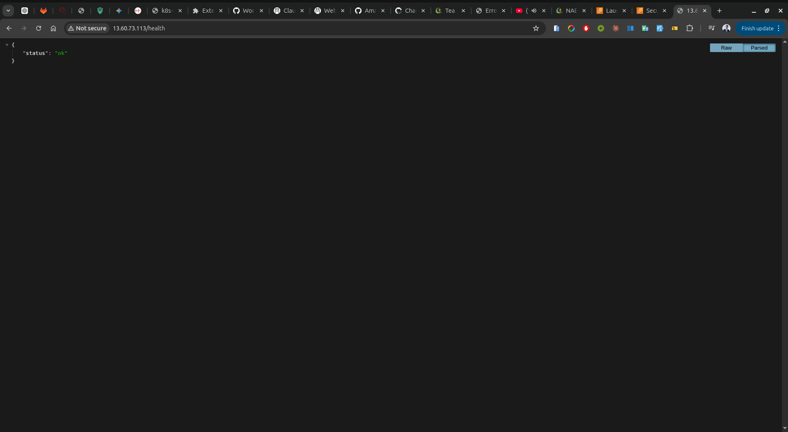

## 1. Cloud Provider & Architecture Decisions
**Provider:** Amazon Web Services (AWS)
**Service:** Elastic Compute Cloud (EC2)

**Why AWS EC2?** EC2 was selected because it provides secure, resizable compute capacity in the cloud. We provisioned an **Amazon Linux 2023 `t3.micro` instance**. This specific OS and instance size were chosen because they provide a highly optimized, lightweight, container-ready foundation that fits perfectly within the AWS Free Tier, ensuring zero operational costs for this deployment.

## 2. Security & Virtual Machine Setup
A custom AWS Security Group (Firewall) was created with strict rules to follow the principle of least privilege:

* **HTTP (Port 80):** Opened to the world (`0.0.0.0/0`) to allow legitimate client traffic to reach the Node.js API.
* **SSH (Port 22):** Restricted strictly to the administrator's local IP address. This completely prevents brute-force attacks and unauthorized access attempts from the public internet.

## 3. The CI/CD Pipeline (GitHub Self-Hosted Runner)
Because SSH was locked down for security, GitHub Actions' default cloud runners could not connect to the server to deploy the code. 

To solve this without compromising the firewall, we installed a **GitHub Self-Hosted Runner** directly onto the EC2 instance. 
* The server reaches *out* to GitHub to pull deployment jobs.
* This requires zero inbound firewall rules, keeping the server completely secure.
* *Configuration Note:* Amazon Linux 2023 requires the manual installation of `.NET` dependencies (`sudo dnf install libicu -y`) for the runner to operate successfully. The runner was installed as a persistent background service.
## 4. Server Configuration (Docker Installation)

The following commands were executed on the Amazon Linux 2023 EC2 instance to prepare the container runtime environment:

```bash
# Update the system packages to the latest secure versions
sudo dnf update -y

# Install the Docker engine
sudo dnf install docker -y

# Start the Docker daemon immediately
sudo systemctl start docker

# Ensure Docker starts automatically to survive reboots
sudo systemctl enable docker

# Allow the default ec2-user to execute docker commands without sudo
sudo usermod -aG docker ec2-user
```
*(Note: Logging out and back in is required for the group changes to take effect.)*

## 5. Image Pulling & Deployment

Software delivery is fully automated. When new code is pushed to the `main` branch, the Continuous Delivery pipeline runs tests, builds an immutable image tagged with the Git commit SHA, and pushes it to the GitHub Container Registry (GHCR). 

Using our Self-Hosted Runner, the EC2 instance automatically pulls the fresh image and restarts it using native Docker commands. Here is exactly how the pipeline pulls the image:
```bash
docker pull ghcr.io/<owner>/app:<sha>
docker rm -f kora-app || true
docker run -d --name kora-app -p 80:3000 -e PORT=3000 ghcr.io/<owner>/app:<sha>
```

**How to check if the container is running:**
SSH into the EC2 instance and execute the process status command. You should see `kora-app` with a status of `Up`:
```bash
docker ps
```

**To verify the deployment is resolving HTTP traffic:**
```bash
curl http://13.60.73.113/health
```
**Example of my test:**


## 6. Log Management

If anomalies occur, an engineer can investigate the live streaming telemetry directly on the host using:

```bash
docker logs -f kora-app
```
*(Passing the `-f` flag "follows" the live stream, which is the Docker equivalent of `tail -f` in standard Linux).*

## 7. Bonus: Automated Rollback Pipeline

**Objective:** Implement a self-healing rollback step if the newly deployed image fails its health check.

**How it works:**
In our `deploy.yml`, the pipeline captures the name of the *currently running* container's image before safely destroying it. After the new image boots, the pipeline waits 5 seconds and pings the `/health` endpoint natively from the localhost using `curl`. 

If `curl` fails (returns a non-200 HTTP code or cannot connect), the pipeline immediately trashes the broken container and respins the exact `CURRENT_IMAGE` that was running perfectly prior to the deployment. It then safely exits the CI/CD job with an error, alerting engineers that the code was bad while keeping the production environment stable and online for customers.
