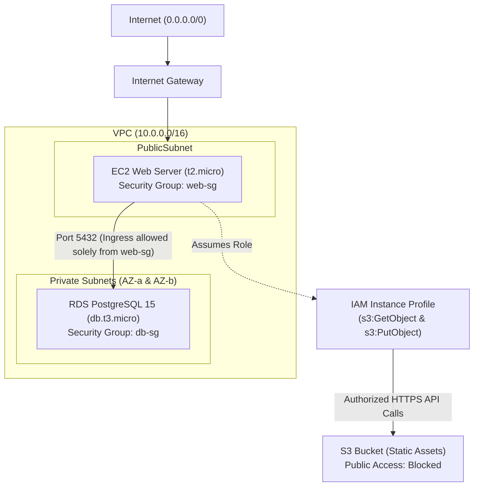

# Vela Payments — Infrastructure Blueprint

This repository contains the declarative Infrastructure as Code (IaC) required to provision the Vela Payments platform securely, reproducibly, and efficiently on AWS. The infrastructure provisions a two-tier web application architecture utilizing EC2, RDS (PostgreSQL), and S3.

---

## 1. Architecture Diagram

The following diagram illustrates the flow of traffic, logical network separation, and identity-driven security boundaries.



---

## 2. Setup & Execution Instructions

To review or deploy this infrastructure locally, follow the steps below. 

### Step 1: Configure AWS Credentials
Terraform requires programmatic access to your AWS account. Export your credentials as environment variables in your terminal:
```bash
export AWS_ACCESS_KEY_ID="your_access_key_here"
export AWS_SECRET_ACCESS_KEY="your_secret_key_here"
export AWS_DEFAULT_REGION="us-east-1"
```

### Step 2: State Backend Setup (Crucial)
This project enforces best practices by utilizing remote state management to prevent local file corruption and enable team collaboration. **You must manually bootstrap the S3 backend before running Terraform.**

1. Create a globally unique S3 bucket in your AWS account (e.g., `vela-terraform-state-amuza`).
2. Open `infra/provider.tf` and locate line 16. Modify the placeholder string to match the S3 bucket you just created:
   ```hcl
   bucket = "REPLACE_WITH_YOUR_UNIQUE_BUCKET_NAME" # Replace this string

### Step 3: Execution
Once the backend is bootstrapped and configured, navigate to the `infra/` directory and execute the Terraform workflow:

```bash
cd infra/
terraform init
terraform plan -var-file="example.tfvars"
```
*(Note: To execute against a live environment, create a new `production.tfvars` file securely injecting your database passwords and apply with `terraform apply -var-file="production.tfvars"`).*

---

## 3. Variable Reference

All hardcoded, environment-specific values have been extracted into variables to ensure the blueprint is fully reusable across different AWS accounts or staging tiers.

| Variable Name | Type | Description |
|---|---|---|
| `aws_region` | `string` | The target AWS region to deploy all resources into (e.g., `us-east-1`). |
| `vpc_cidr` | `string` | The IPv4 CIDR block bounding the custom VPC ecosystem. Defaults to `10.0.0.0/16`. |
| `allowed_ssh_cidr` | `string` | A strict IPv4 CIDR notation representing the single authorized IP address allowed to initiate SSH connections to the EC2 server (e.g., `203.0.113.5/32`). |
| `s3_bucket_name` | `string` | The globally unique designation for the S3 static assets bucket. |
| `db_username` | `string` | The master administrator username for the RDS instance (`sensitive = true`). |
| `db_password` | `string` | The master administrator password for the RDS instance (`sensitive = true`). |

---

## 4. Design Decisions

### Security & Isolation (Defense in Depth)
The PostgreSQL RDS instance is intentionally placed within **Private Subnets** entirely lacking pathways to an Internet Gateway (`publicly_accessible = false`). Furthermore, the database firewall (`aws_security_group.db`) does not authorize ingress via IP blocks. Instead, it utilizes **Security Group Chaining**, explicitly accepting Port 5432 traffic only if the originating resource securely identifies as a member of `aws_security_group.web`. This implements true Zero Trust: even if a malicious resource breaches the private subnet, it cannot communicate with the database unless it specifically bears the web server security identifier.

### Credential Management 
We strictly rejected the anti-pattern of burying hardcoded, long-lived AWS IAM access keys within the EC2 instance's `.env` files or application code. Rather, we provisioned an **IAM Rule & Instance Profile** scoped definitively to `s3:GetObject` and `s3:PutObject` for our targeted bucket. The EC2 instance securely leverages AWS metadata services to mint temporary, dynamically rotating STS tokens at runtime. If the web server is ever compromised via a remote code execution vulnerability, the attacker steals a temporary token limited entirely to basic S3 read/writes, rather than full account credential access.

---

## 5. Bonus Accomplishment: RDS Snapshot Lifecycle

As an added layer of operational safety, the **Automated RDS Snapshot** bonus requirement has been successfully implemented within `infra/database.tf`. 

In standard configurations, issuing a `terraform destroy` will annihilate the RDS cluster instantly, resulting in catastrophic data loss. To combat this, `skip_final_snapshot` was flipped to `false`, and an explicit `final_snapshot_identifier` was bound to the database resource. If the infrastructure is ever torn down, Terraform will halt the destruction process and mandate that AWS physically backs up the database block storage to a permanent snapshot first. The database shuts down, but the data persists forever until manually pruned by an administrator.
