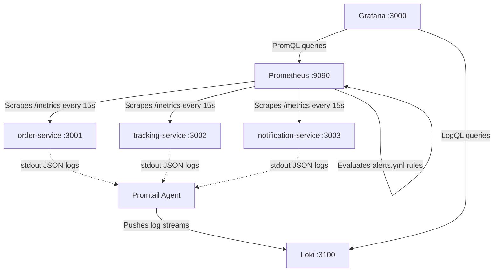
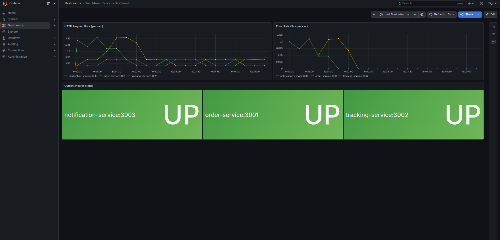

# WatchTower Observability Stack

This repository implements a full PLG (Prometheus, Loki, Grafana) observability stack for Reyla Logistics' microservice backend. The objective is to apply enterprise-grade observability practices—automated metrics collection, provisioned dashboards, declarative alerting rules, and centralized log aggregation—so the engineering team can detect and diagnose production incidents before customers are ever impacted.

---

## 1. Architecture Diagram



---

## 2. Setup Instructions

### Prerequisites
- Docker Engine 20.10+
- Docker Compose v2

### Quick Start

1. **Configure environment variables:**
   ```bash
   cp app/.env.example app/.env
   ```

2. **Launch the full stack:**
   ```bash
   cd app
   docker compose up -d --build
   ```

3. **Verify all services are operational:**

   Check Prometheus targets:
   ```bash
   curl -s http://localhost:9090/api/v1/targets | jq -r '.data.activeTargets[] | "\(.labels.instance) => \(.health)"'
   ```
   Expected output:
   ```
   order-service:3001 => up
   tracking-service:3002 => up
   notification-service:3003 => up
   ```

   Check Loki readiness:
   ```bash
   curl -s http://localhost:3100/ready
   ```

   Check Grafana dashboard:
   Open `http://localhost:3000` — the provisioned dashboard loads automatically without requiring login.

---

## 3. Dashboard Walkthrough



The Grafana dashboard is fully provisioned as code (`grafana/dashboards/dashboard.json`) and loads automatically on container startup. No manual import steps are required.

| Panel | Description |
|---|---|
| **Current Health Status** | Displays the live `up` metric for each service. A green "UP" means Prometheus is successfully scraping the target; a red "DOWN" means the scrape has failed. |
| **HTTP Request Rate** | Calculates `rate(http_requests_total[1m])` per service instance, showing the live throughput in requests per second over a rolling 1-minute window. |
| **Error Rate (5xx)** | Filters for `status=~"5.."` response codes to isolate server-side errors as a separate time series, enabling rapid detection of application failures. |
| **Live Container Logs (Loki)** | Streams real-time application logs directly from Loki using LogQL (`{job="dockerlogs"}`), allowing operators to correlate metric anomalies with the exact log output that caused them. |

---

## 4. Alert Testing

The alerting rules are defined declaratively in `prometheus/alerts.yml` and loaded automatically via the `rule_files` directive in `prometheus.yml`. Each alert was manually tested to confirm it transitions correctly from `Inactive` → `Pending` → `Firing`.

### ServiceDown (Severity: Critical)
**Condition:** The `/health` endpoint returns non-200 responses for more than 1 minute.

**Test procedure:**
```bash
# Stop a service container entirely
docker compose stop order-service

# Wait 60 seconds, then verify in the Prometheus Alerts UI:
# http://localhost:9090/alerts
# The ServiceDown alert should transition to FIRING.

# Restore the service
docker compose start order-service
```

### ServiceNotScraping (Severity: Warning)
**Condition:** Prometheus fails to receive metrics from a service for more than 2 minutes.

**Test procedure:**
```bash
# Disconnect a running container from the shared network
docker network disconnect app_watchtower_network notification-service

# The container stays alive but Prometheus can no longer reach it.
# Wait 2 minutes, then check the Alerts UI for FIRING state.

# Reconnect the service
docker network connect app_watchtower_network notification-service
```

### HighErrorRate (Severity: Warning)
**Condition:** More than 5% of requests return 5xx errors over a 5-minute window.

**Test procedure:**
```bash
# Hit a route that returns 500 errors in a tight loop
while true; do curl -s http://localhost:3001/simulate-500 > /dev/null; sleep 0.1; done &

# Simultaneously generate normal traffic to establish a baseline
while true; do curl -s http://localhost:3001/health > /dev/null; sleep 1; done &

# The error ratio exceeds the 5% threshold. After 5 minutes, the alert fires.
# Kill background loops when done:
kill %1 %2
```

---

## 5. Structured Logging & Loki Bonus

### Log Driver Configuration

All application services use the Docker `json-file` logging driver with rotation limits configured directly in `docker-compose.yml`:
```yaml
logging:
  driver: "json-file"
  options:
    max-size: "10m"
    max-file: "3"
```
This caps disk usage at 30MB per service and prevents uncontrolled log growth from exhausting host storage.

### Command 1: View live logs from all services

```bash
docker compose logs -f order-service tracking-service notification-service
```

Output:
```
notification-service  | {"level":"info","service":"notification-service","msg":"Listening on port 3003"}
order-service         | {"level":"info","service":"order-service","msg":"Listening on port 3001"}
tracking-service      | {"level":"info","service":"tracking-service","msg":"Listening on port 3002"}
```

### Command 2: Filter logs to show only errors from a specific service

```bash
docker compose logs --no-log-prefix order-service | jq 'select(.level == "error")'
```

Output (when errors are present):
```json
{
  "level": "error",
  "service": "order-service",
  "msg": "Failed to process order ORD-1745592617000"
}
```

### Bonus Integration: Centralized Log Aggregation with Loki

Running `docker compose logs` and piping through `jq` is practical for local development, but it does not scale in production distributed systems. When services are spread across multiple hosts, engineers should never need to SSH into individual servers or manually tail log files to troubleshoot an incident.

To address this, **Grafana Loki** and **Promtail** were added to the observability stack. Promtail runs as a lightweight agent that mounts the host's `/var/lib/docker/containers` directory in read-only mode and continuously scrapes every container's JSON stdout. It then pushes those log streams to Loki, which indexes them by label rather than by full-text content—keeping storage costs and resource consumption dramatically lower than alternatives like Elasticsearch.

The result is a unified "single pane of glass" experience inside Grafana: operators can view live metrics (request rates, error percentages, health status) and the corresponding application logs side-by-side in the same dashboard. When an alert fires for a spike in 5xx errors, the engineer can immediately scroll down to the Loki panel and read the exact stack traces that caused it—without ever leaving the browser, opening a terminal, or knowing which host the failing container is running on.
